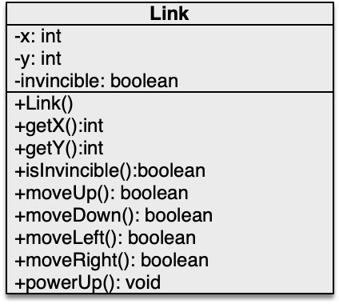

# OOP - WS 2023/24 - Exercise 02

## Object Oriented Programming - 2309 - Prof. Ronny Hartanto

---  

### Maximum number of "**commit/push**" for this homework is **5**

> If you commit/push into the repository more than 5 times, you will not get any points for this homework. 
> Initially, github will create your repository by filling it up with necessary contents. Therefore, you will start with x commits. The commit/push limitation is counted toward your commits, thus you should not exceed the x + 5 commits in total to receive the points for this homework. 

--- 

## Assignments

1. Implement the **Link** class as depicted in the UML-Diagram below. (in Link.java) Link is the main character in Zelda game. Make sure the class meets the following conditions / behaviours:   
* Initially, Link will be instantiated at (0,0) and not invincible. 
* Link lives in cartesian coordinate; every movement action will increment or decrement its coordinate accordingly, e.g., moveUp() will increment y position.  
* The world where Link moves is a square world consistings 25 cells on each axes. The origin of the coordinate is exactly on the middle of the map.
* powerUp() method will make Link invincible against the opponents for duration of 5 movements. 
* The movement actions return boolean, which tell whether it successfully execute the command. If Link hits a wall, it will return false and neither changes its location nor increments the tick for updating the invincible status.   

2. Design a class named **Rectangular** to represent a box. The class contains:  
* Two double data fields named *side1* and *side2* that specify the dimension of the rectangular object. The default values are 1 for both side1 and side2.
* A no-args constructor that creates a default rectangular.
* A constructor that creates a rectangular with the specified side1 and side2. Make sure you check against invalid values. If invalid value is given in the arguments, then the default constructor will be used instead. 
* A method named *getArea()* that returns the area of this rectangular object.
* A method name *getPerimeter()* that returns the perimeter.
* A method name *isSquare()* that returns boolean value indicating a square object.  
Draw the *UML diagram* for the class then implement the class. *Upload your UML diagram in UML folder*. Create your own java file inside the main java folder, where the Link.java is located.

---

## Instruction
You have to work on your local machine to do this homework. Please don't use the WebIDE as it will use up your "commit/push" tokens. 

**Please follow the following steps:**
1. Clone the repository into your local computer. (you can use terminal or any Git client)
2. Open the local repository on your local computer using your favourite editor (text editor or IDE)
3. Work on your assigment solve all the given problem, make sure they run on your computer. **Don't change the structure of the directory**
4. If you completed all the assigments, *commit* your change to Git and *push* it to the Github (using your GitClient or terminal)
5. Check your submission by visiting your Github repository, after a while you should be able to see the result (:white_check_mark: or :x:)
6. If you have :white_check_mark: then you are done with your homework, otherwise repeat step 3 onward. 

--- 

## Important

You can ONLY change files inside the **src/main/java** folder and place your name in this readme file. Depending on your task, you might need to create a new class in the **src/main/java** folder. Please don't make any modification anywhere else. 

**Make sure you submit your homework before the deadline.** 
> If you submit after the deadline, it will not be graded

---
## Notes
* **WS2023/24** The points are not part of the final assessment. This purely exercise to help you learn Java programming.
* The submission will be evaluated automatically (most of the case)!
    * If it doesn't compile, it could be some mistakes on your submission. 
* You will receive the points upon successful solving the tasks. 
* You can make or modify your submission before the deadline
* Make sure you don't exceed the limit, sometime it's better to get partial points than exceeding the limit. 
* Use this homework to practice your programming skill
